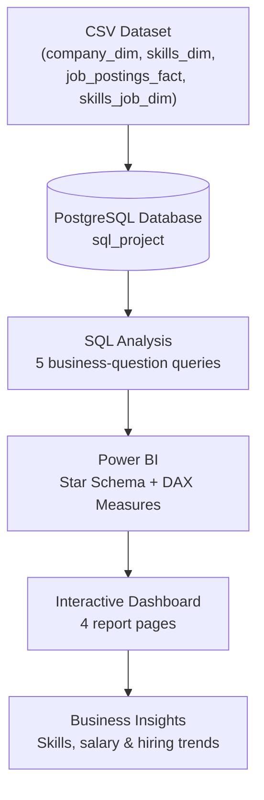
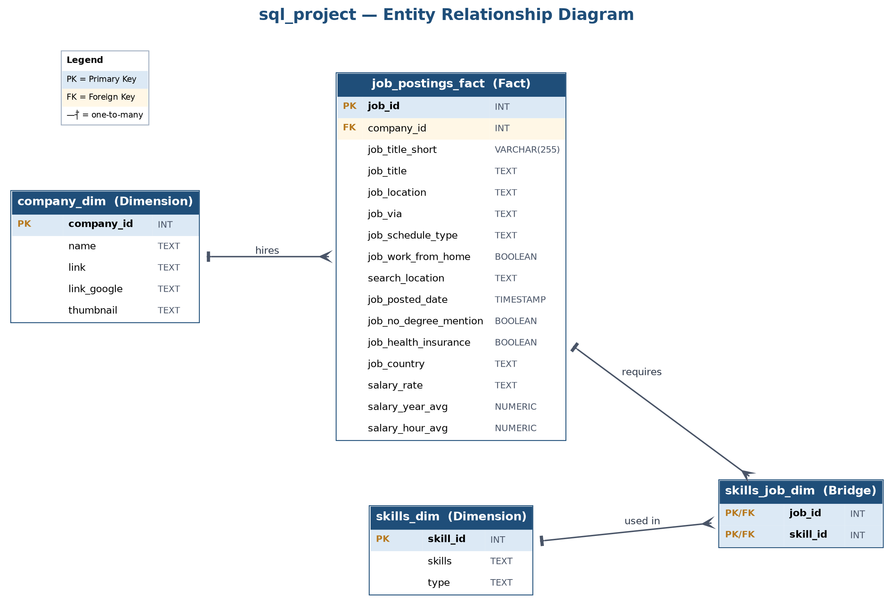
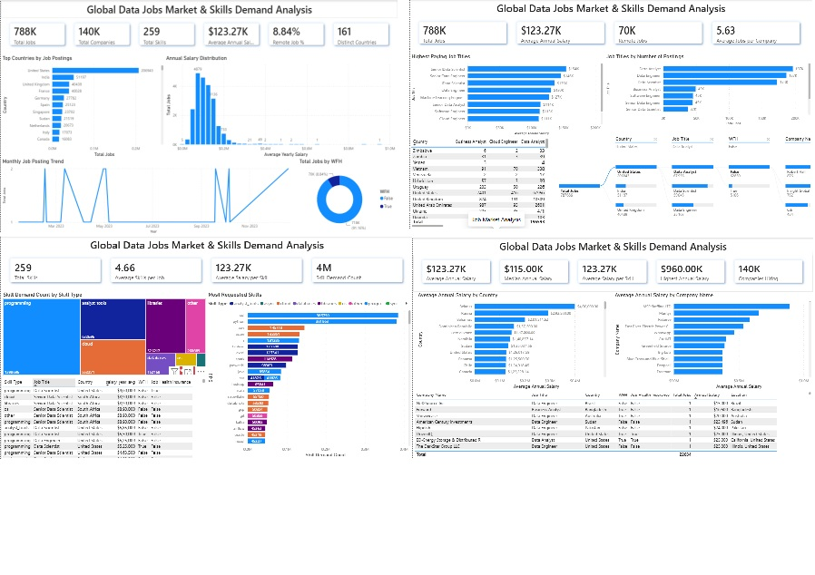

<div align="center">

# 🌐 Global Data Jobs Market & Skills Demand Analysis

### End-to-End Data Analytics Project using PostgreSQL, SQL & Power BI

*Transforming 787K+ global job postings into actionable insights on where the data job market is heading — and which skills actually pay — using PostgreSQL, SQL, and Power BI.*


</div>

---

## 📋 Table of Contents

- [Project Overview](#-project-overview)
- [Business Problem](#-business-problem)
- [Project Objectives](#-project-objectives)
- [Dataset Overview](#-dataset-overview)
- [Project Architecture](#-project-architecture)
- [Database Design](#-database-design)
- [SQL Analysis](#-sql-analysis)
- [SQL Skills Demonstrated](#-sql-skills-demonstrated)
- [Power BI Development](#-power-bi-development)
- [Dashboard Walkthrough](#-dashboard-walkthrough)
- [Business Insights](#-business-insights)
- [Recommendations](#-recommendations)
- [Technology Stack](#-technology-stack)
- [Repository Structure](#-repository-structure)
- [Installation](#-installation)
- [Dashboard Preview](#-dashboard-preview)
- [Skills Demonstrated](#-skills-demonstrated)
- [Learning Outcomes](#-learning-outcomes)
- [Future Improvements](#-future-improvements)
- [Acknowledgements](#-acknowledgements)

---

## 📌 Project Overview

This project is an end-to-end Business Intelligence build: raw job posting data is loaded into a normalized PostgreSQL database, interrogated with a series of increasingly targeted SQL queries, and then rebuilt as a four-page interactive Power BI dashboard on top of a proper star schema.

The motivation is a common one for anyone entering or navigating the data field: job titles, tools, and "in-demand skill" lists change fast, and most of what's written about them is anecdotal. This project treats the question empirically instead — pulling **787,686 job postings**, **259 distinct skills**, and **~140K hiring companies** across **161 countries** into a single analytical model, then letting the data answer questions that are usually answered by opinion: *which roles pay the most, which skills show up the most, and which skills are worth the time to learn.*

Why it matters: the SQL layer demonstrates the ability to design a relational schema and write production-style analytical queries (CTEs, joins across fact/dimension/bridge tables, aggregation, filtering, `HAVING`-based demand thresholds). The Power BI layer demonstrates the ability to take that same data, model it correctly (star schema, dedicated date table, a centralized measures table), and turn it into something a non-technical stakeholder can actually use to make a decision — which is the part that separates a SQL exercise from a Business Intelligence solution.

---

## 🎯 Business Problem

Job seekers and hiring teams are both operating with incomplete information:

- **Job seekers** don't have a reliable, current answer to *"what should I learn next?"* — advice online is often outdated, US-centric, or based on a handful of anecdotes rather than posting volume.
- **Hiring managers and recruiters** don't have an easy way to benchmark *"is this salary competitive for this skill set, in this market?"* without pulling and reconciling data manually.
- **Career changers** need to know where the demand/salary trade-off actually sits — is the highest-*demand* skill also the highest-*paying* one, or are they different skills entirely?

This project answers those questions directly, using postings data rather than opinion, and packages the answer as a dashboard that updates from the source database rather than a one-off analysis.

---

## 🧭 Project Objectives

- Design and populate a normalized PostgreSQL database from raw job posting data.
- Answer a defined set of business questions using progressively more advanced SQL (filtering → joins → CTEs → aggregation → demand/salary thresholds).
- Model the same data as a Power BI star schema suitable for interactive, self-service analysis.
- Build a multi-page dashboard that lets a non-technical user explore the job market by country, job title, skill, and company without writing a query.
- Translate both the SQL findings and the dashboard visuals into skill-development recommendations for data professionals at different career stages.

---

## 🗂️ Dataset Overview

| | |
|---|---|
| **Source** | Job postings dataset originally compiled by [Luke Barousse](https://www.lukebarousse.com/) |
| **Dataset** | 📁 [Google Drive Dataset (CSV Files)](https://drive.google.com/drive/folders/1pqzd7xQ05TUIEbMuR5N0e8PtLeCifK5y?usp=sharing) |
| **Grain** | One row per job posting, exploded to one row per (job posting × skill) via a bridge table |
| **Scale (as loaded)** | 787,686 job postings · 259 distinct skills · ~140K companies · 161 countries |
| **Time coverage** | Job postings dated across 2023 (monthly posting activity is tracked on the dashboard) |

**Key columns loaded into `job_postings_fact`:**

| Column | Purpose |
|---|---|
| `job_title_short` / `job_title` | Standardized role family (e.g., Data Analyst) vs. the full, as-posted title |
| `job_location` / `job_country` / `search_location` | Where the role is based vs. the location the posting was scraped under |
| `job_via` | Job board / source the posting came from |
| `job_schedule_type` | Employment type (e.g., full-time, contract) |
| `job_work_from_home` | Boolean remote-work flag, used throughout the dashboard as **WFH** |
| `job_no_degree_mention` | Boolean flag for postings that explicitly don't require a degree |
| `job_health_insurance` | Boolean flag for postings that mention health insurance as a benefit |
| `salary_year_avg` / `salary_hour_avg` / `salary_rate` | Normalized compensation fields, used for every salary-based query and visual |
| `job_posted_date` | Drives the monthly posting-trend analysis |

---

## 🏗️ Project Architecture



The pipeline is intentionally linear: nothing in the Power BI layer is calculated independently of what the PostgreSQL schema and SQL scripts already established — the dashboard's measures and the SQL queries answer the same underlying business questions, just at different levels of interactivity.

---

## 🗄️ Database Design

The schema lives in [`sql/database`](sql/database) and follows a standard fact/dimension/bridge pattern:

| Table | Role | Key(s) |
|---|---|---|
| `job_postings_fact` | **Fact table.** One row per job posting: title, location, schedule type, WFH flag, salary fields, posted date. | `job_id` (PK) · `company_id` (FK → `company_dim`) |
| `company_dim` | **Dimension.** One row per hiring company, including name and links. | `company_id` (PK) |
| `skills_dim` | **Dimension.** One row per distinct skill, with a `type` category (e.g., programming, cloud, analyst_tools). | `skill_id` (PK) |
| `skills_job_dim` | **Bridge table.** Resolves the many-to-many relationship between postings and skills (a posting can require many skills; a skill appears in many postings). | Composite PK (`job_id`, `skill_id`) · FK → `job_postings_fact` · FK → `skills_dim` |

**Indexing:** `idx_company_id` on `job_postings_fact.company_id`, plus `idx_skill_id` and `idx_job_id` on `skills_job_dim`, defined in [`2_create_tables.sql`](sql/database/2_create_tables.sql) specifically to keep the fact-to-bridge and bridge-to-dimension joins performant, since every analysis query in this project joins through `skills_job_dim`.

**Data load:** [`3_modify_tables.sql`](sql/database/3_modify_tables.sql) loads the four source CSVs (`company_dim.csv`, `skills_dim.csv`, `job_postings_fact.csv`, `skills_job_dim.csv`) via `psql`'s `\copy`, and documents the two most common failure modes when re-running the load (permission-denied on the CSV path, and duplicate-key violations from re-running against a non-empty database) along with the fix for each.

**ER Diagram:**



---

## 🔎 SQL Analysis

All queries live in [`sql/analysis`](sql/analysis) and build on each other in complexity. Full scripts are in the repository — this section tells the analytical story rather than reproducing the code.

### 1. Top-Paying Data Analyst Jobs — [`1_top_paying_jobs.sql`](sql/analysis/1_top_paying_jobs.sql)

- **Business Question:** What do the highest-paying Data Analyst postings actually look like?
- **Approach:** Filter `job_postings_fact` to the `Data Analyst` title family, restrict to postings tagged as fully remote (`'Anywhere'`) or based in India, require a non-null salary, and return the top 10 by `salary_year_avg`.
- **SQL Concepts:** `LEFT JOIN` to `company_dim`, multi-condition `WHERE` with `IN`, `IS NOT NULL` filtering, `ORDER BY … DESC`, `LIMIT`.
- **Key Finding:** The top result is an Associate Director – Data Insights role at AT&T, averaging roughly **$256K**.
- **Business Value:** Gives a job seeker a concrete, current benchmark for what "top of market" compensation looks like, rather than a generic salary survey figure.

### 2. Skills Behind the Top-Paying Jobs — [`2_top_paying_job_skills.sql`](sql/analysis/2_top_paying_job_skills.sql)

- **Business Question:** What do those top 10 highest-paying jobs actually require?
- **Approach:** Wrap query 1 in a CTE, then `INNER JOIN` through `skills_job_dim` into `skills_dim` to unpack every skill tied to each of those 10 postings.
- **SQL Concepts:** `WITH` (CTE), chained `INNER JOIN` across three tables, `ORDER BY`.
- **Key Finding:** SQL and Python appear most consistently across the top-paying postings, and the highest-paying roles specifically add cloud/big-data/DevOps tooling (AWS, Azure, Snowflake, Databricks, Git-based workflows) on top of that base.
- **Business Value:** Shows that the ceiling on compensation isn't reached with a single tool — it's reached by pairing core programming/query skills with cloud and big-data fluency.

### 3. Most In-Demand Skills — [`3_top_demanding_skills.sql`](sql/analysis/3_top_demanding_skills.sql)

- **Business Question:** Across the broader market (not just top-paying roles), which skills show up most often?
- **Approach:** Join postings to skills for the `Data Analyst` and `Business Analyst` title families, restricted to remote (`job_work_from_home = True`) postings, then group and count.
- **SQL Concepts:** `INNER JOIN` ×2, `GROUP BY`, `COUNT()`, `ORDER BY … DESC`, `LIMIT`.
- **Key Finding:** SQL leads with **8,557** remote postings requiring it, with Excel and Python close behind, and Tableau/Power BI still showing strong demand.
- **Business Value:** Identifies the "table stakes" skills — the ones a candidate is expected to already have before demand-vs-salary trade-offs even come into play.

### 4. Highest-Paying Skills — [`4_top_skills_based_on_salary.sql`](sql/analysis/4_top_skills_based_on_salary.sql)

- **Business Question:** Independent of how *common* a skill is, which skills are associated with the highest average salary?
- **Approach:** Join postings to skills for the Data/Business Analyst title families with a non-null salary, group by skill, and average the salary.
- **SQL Concepts:** `INNER JOIN` ×2, `GROUP BY`, `AVG()`, `ROUND()`, `ORDER BY … DESC`, `LIMIT`.
- **Key Finding:** SVN tops the list at roughly **$246K** average — almost certainly a small-sample effect from a niche skill appearing in only a few (high-paying) postings, not a broad market signal. Below that, blockchain (Solidity), cloud databases, and MLOps/AI tooling cluster above $150K.
- **Business Value:** Surfaces where *specialization* is being rewarded, and just as importantly, flags the limitation of ranking by average salary alone (a theme the next query is built to correct for).

### 5. Most Optimal Skills — [`5_most__optimal_skills.sql`](sql/analysis/5_most__optimal_skills.sql)

- **Business Question:** Which skills give the best combination of *high demand* **and** *high salary* — i.e., which are actually worth prioritizing?
- **Approach:** Join postings to skills for `Data Analyst`, filter to non-null salaries, group by skill, and use `HAVING COUNT(...) > 50` to exclude thinly-supported skills before ranking by demand and then salary.
- **SQL Concepts:** `INNER JOIN` ×2, multi-column `GROUP BY`, `COUNT()` + `AVG()` + `ROUND()`, **`HAVING`** (post-aggregation filtering — the key concept this query adds over query 4), multi-column `ORDER BY`, `LIMIT`.
- **Key Finding:** SQL again leads on demand (3,083 qualifying postings) and remains foundational; cloud/big-data tools (AWS, Azure, Spark, Snowflake) offer the best *demand-adjusted* salary premium ($105K–$113K); general office tools (Excel, Word, PowerPoint) show high usage but comparatively lower pay.
- **Business Value:** This is the query that directly answers "what should I learn next" — it's the one that corrects for the small-sample skew seen in query 4 by requiring a demand floor first.

---

## 🧠 SQL Skills Demonstrated

| Concept | Demonstrated In |
|---|---|
| Table & database creation, data types | `1_create_database.sql`, `2_create_tables.sql` |
| Primary keys & composite primary keys | `2_create_tables.sql` (`skills_job_dim`) |
| Foreign key constraints | `2_create_tables.sql` |
| Indexing for join performance | `2_create_tables.sql` |
| Bulk data loading (`\copy`) & load troubleshooting | `3_modify_tables.sql` |
| `LEFT JOIN` / `INNER JOIN` | `1_top_paying_jobs.sql` → `5_most__optimal_skills.sql` |
| Common Table Expressions (CTEs) | `2_top_paying_job_skills.sql` |
| Filtering (`WHERE`, `IN`, `IS NOT NULL`, boolean flags) | All analysis queries |
| Grouping & aggregation (`GROUP BY`, `COUNT`, `AVG`, `ROUND`) | `3_top_demanding_skills.sql` → `5_most__optimal_skills.sql` |
| Post-aggregation filtering (`HAVING`) | `5_most__optimal_skills.sql` |
| Sorting & top-N filtering (`ORDER BY`, `LIMIT`) | All analysis queries |

---

## ⚡ Power BI Development

The report was inspected directly from the `.pbix` file to document what's actually in the model rather than assuming a standard build:

- **Data connection:** Data is pulled from the same PostgreSQL `sql_project` database via Power BI's native PostgreSQL connector and loaded into the model (Import mode), so the dashboard runs against a locally cached copy of the query results rather than hitting Postgres live on every interaction.
- **Data model — star schema:** `job_postings_fact` sits at the center, with `company_dim` and `skills_dim` as conformed dimensions, `skills_job_dim` as the bridge resolving the posting↔skill many-to-many relationship, plus a dedicated **`Date`** table (with a Year → Quarter → Month → Day hierarchy) driving the monthly trend visual.
- **Measures table:** All DAX measures are centralized in a disconnected `measures_table` rather than scattered across the fact table — a deliberate modeling choice that keeps the field list clean for end users and mirrors how larger BI teams organize production models.
- **Measures built:** Total Jobs, Total Companies, Total Skills, Distinct Countries, Average Annual Salary, Median Annual Salary, Highest Annual Salary, Remote Job % / Remote Jobs, Average Jobs per Company, Average Skills per Job, Average Salary per Skill, Skill Demand Count, and Companies Hiring — 13 measures in total, feeding every KPI card across the four report pages. (Per project scope, DAX expressions themselves aren't reproduced here — see the `.pbix` for the live formulas.)
- **Cross-filtering & drill-down:** Slicers on Country, Job Title, WFH, and Company Name filter the pivot table on the Job Market page; a decomposition tree lets users drill Total Jobs interactively through Country → Job Title → WFH → Company Name without pre-building every combination as a separate visual.
- **Dashboard design:** Four purpose-built pages (rather than one dense page) so each page answers one class of question — market size, job titles, skills, and salary/company — with consistent KPI-card-plus-visual layout across all of them.

---

## 📊 Dashboard Walkthrough

> The full report is in [`powerbi/job_market_skills_demand_analysis.pbix`](powerbi/job_market_skills_demand_analysis.pbix); static exports are in [`dashboard.pdf`](images/dashboard.pdf) and [`dashboard_screenshot.jpg`](images/dashboard_screenshot.jpg).

### Page 1 — Executive Overview
- **Business Question:** At a glance, how big is this market and where does it sit geographically?
- **KPIs:** 788K Total Jobs · 140K Total Companies · 259 Total Skills · $123.27K Average Annual Salary · 8.84% Remote Job % · 161 Distinct Countries
- **Visuals:** Horizontal bar of top countries by postings, a histogram of annual salary distribution, a monthly job-posting trend line, and a WFH donut chart.
- **Insights:** The United States accounts for 206,943 postings — roughly four times the next country, India (51,197), followed by the UK (40,439) and France (40,028). The WFH donut confirms remote work is the exception rather than the norm at 8.84% (≈70K of 788K postings), with 91.16% on-site.
- **Purpose:** Orients any viewer — recruiter or analyst — to the overall scale and shape of the market before they drill into specifics on later pages.

### Page 2 — Job Market Analysis
- **Business Question:** Which job titles pay the most, and which are posted the most — and are those the same titles?
- **KPIs:** 788K Total Jobs · $123.27K Average Annual Salary · 70K Remote Jobs · 5.63 Average Jobs per Company
- **Visuals:** "Highest Paying Job Titles" bar chart, "Job Titles by Number of Postings" bar chart, a Country × Job Title pivot table, and an interactive decomposition tree.
- **Insights:** Data Analyst (197K), Data Engineer (187K), and Data Scientist (173K) are the highest-*volume* titles, but the highest-*paying* titles are Senior Data Scientist ($154K) and Senior Data Engineer ($146K) — seniority, not posting volume, drives top compensation. The decomposition tree lets a user trace, for example, that of 787,686 total postings, 206,943 are in the United States, of which 67,956 are Data Analyst roles, of which 62,850 are on-site — down to individual top-hiring companies like Robert Half and Insight Global.
- **Purpose:** Separates "what's being hired for the most" from "what pays the most," which is the exact distinction a job seeker planning a title/seniority path needs.

### Page 3 — Skills Analysis
- **Business Question:** Which specific skills and skill categories dominate the market?
- **KPIs:** 259 Total Skills · 4.66 Average Skills per Job · $123.27K Average Salary per Skill · 4M Skill Demand Count
- **Visuals:** A treemap of skill demand by category, a "Most Requested Skills" bar chart, and a detail table.
- **Insights:** Programming-type skills are the single largest category by demand count (1,398,696), ahead of analyst tools (632,696) and cloud (552,271). At the individual-skill level, SQL (385,750) and Python (381,863) dwarf every other skill, with AWS (145,718), Azure (132,851), and R (131,285) forming a clear second tier, and Tableau/Excel (~127K each) confirming that reporting tools remain just as requested as major cloud platforms.
- **Purpose:** Gives the most granular, skill-by-skill view in the report — the page most directly useful for deciding what to learn next.

### Page 4 — Salary & Company Analysis
- **Business Question:** Where and at which companies does compensation run highest?
- **KPIs:** $123.27K Average Annual Salary · $115.00K Median Annual Salary · $123.27K Average Salary per Skill · $960.00K Highest Annual Salary · 140K Companies Hiring
- **Visuals:** "Average Annual Salary by Country," "Average Annual Salary by Company Name," and a detailed postings table with company, title, country, WFH, and salary fields.
- **Insights:** The country-level ranking is topped by Belarus (~$400K) and Russia (~$292.5K) — figures that should be read as small-sample outliers (a handful of very high-paying postings) rather than a national salary trend, especially compared to the United States' far more heavily-populated $126,017.59 average across 206,943 postings. The same pattern shows up in the company ranking, where the top names (MSP Staffing LTD, Mantys, ReServe, etc.) are likely single- or few-posting averages rather than broad compensation benchmarks.
- **Purpose:** This page is as much a lesson in *reading aggregated data correctly* as it is a salary lookup — the median ($115K) sitting below the mean ($123.27K) is itself evidence of the right-skew that the outlier countries/companies produce.

---

## 💡 Business Insights

> Derived from the SQL analysis and the dashboard; every figure below is sourced directly from the project files.

1. The dataset covers **787,686 job postings** across **161 countries** and roughly **140K** hiring companies.
2. Average annual salary is **$123.27K**, with a **median of $115K** — the gap indicates a right-skewed distribution driven by a smaller number of very high-paying roles.
3. Only **8.84%** of postings (≈70K) are remote — on-site remains the overwhelming norm in this dataset.
4. The **United States** leads all countries with **206,943** postings, roughly 4x India (51,197), the next-largest market.
5. **Data Analyst, Data Engineer, and Data Scientist** are the three highest-*volume* job titles (197K / 187K / 173K), together representing the bulk of demand.
6. Despite lower posting volume, **Senior Data Scientist ($154K)** and **Senior Data Engineer ($146K)** command the highest average salaries of any tracked title — seniority outweighs title popularity when it comes to pay.
7. Companies post **5.63 jobs on average**, suggesting demand is spread across a long tail of employers rather than concentrated in a few mega-hirers.
8. **SQL (385,750)** and **Python (381,863)** are requested far more than any other skill — together they anchor the technical baseline for the entire market.
9. **AWS (145,718)** and **Azure (132,851)** rank third and fourth in overall skill demand, confirming cloud fluency as close to a prerequisite alongside core programming.
10. **Tableau (127,500)** and **Excel (127,341)** remain nearly as in-demand as the leading cloud platforms — reporting/analysis tools have not been displaced by programming skills.
11. Programming-type skills form the largest demand category overall (**1,398,696** mentions), ahead of analyst tools (632,696) and cloud (552,271).
12. The average posting requests **4.66 distinct skills**, confirming most data roles expect a multi-tool skill set rather than one specialization.
13. At the Data/Business Analyst level specifically, SQL again leads demand with **8,557** remote postings, ahead of Excel and Python.
14. Niche or legacy tools can distort salary rankings: **SVN** tops the average-salary-by-skill list at **$246K**, almost certainly reflecting a very small posting count rather than genuine market demand.
15. **Blockchain (Solidity), cloud databases, and MLOps/AI tooling** cluster above $150K average salary — a clear signal of where niche specialization is financially rewarded.
16. When demand and salary are balanced (postings > 50), **SQL** remains the top "optimal" skill for Data Analysts (3,083 qualifying postings), while **cloud/big-data tools (AWS, Azure, Spark, Snowflake)** offer the strongest demand-adjusted salary premium (**$105K–$113K**).
17. General office tools (**Excel, Word, PowerPoint**) show high usage among Data Analyst postings but consistently **lower** average salaries than technical/cloud skills — tool familiarity alone doesn't drive compensation the way technical depth does.
18. The single highest-paying role in the top-10 analysis is an **Associate Director – Data Insights at AT&T (~$256K)**, itself requiring a broad SQL/Python/cloud/big-data mix — reinforcing that top pay favors versatile profiles over single-tool specialists.
19. Country-level averages such as Belarus (~$400K) and Russia (~$292.5K) should be treated cautiously — they're consistent with small-sample skew rather than a broad national salary trend, and are a useful reminder to check posting counts before trusting an average.

---

## 🧭 Recommendations

**For Businesses:** Benchmark compensation against demand-adjusted figures (query 5's methodology), not raw skill-salary averages alone — the latter is easily distorted by low-volume, high-paying outlier postings (see insight #14).

**For Hiring Managers:** If remote work is a differentiator you can offer, use it — at 8.84% of postings, remote roles are still the exception, which means offering one is a genuine competitive lever rather than table stakes.

**For Aspiring Data Analysts:** Prioritize SQL and Python first — they lead demand by a wide margin across every query in this project — then layer in one cloud platform (AWS or Azure) and one visualization tool (Tableau or Power BI), which together match the actual skill combinations seen in the highest-paying postings.

**For Career Planning:** Use query 5's demand-and-salary approach, not query 4's salary-only ranking, when deciding what to learn next — a skill with a huge average salary but a tiny posting count (like SVN) is a much riskier bet than a skill with strong numbers on both dimensions (like SQL, AWS, or Spark).

---

## 🛠️ Technology Stack

| Technology | Role in This Project |
|---|---|
| **PostgreSQL** | Relational database hosting the star-schema-style dataset (`sql_project`) |
| **pgAdmin** | Database administration and CSV data loading via the PSQL Tool |
| **SQL** | Schema design, indexing, and all five business-question analyses |
| **Power BI Desktop** | Data modeling and interactive report/dashboard build |
| **Power Query** | Connecting to PostgreSQL and shaping data on import |
| **DAX** | Centralized measure layer (`measures_table`) powering every KPI and chart |
| **Git & GitHub** | Version control and project hosting |

---

## 📁 Repository Structure

```text
20260701_Job_Market_Skills_Demand_Analysis_SQL_PowerBI/
│
├── sql/
│   ├── database/
│   │   ├── 1_create_database.sql
│   │   ├── 2_create_tables.sql
│   │   └── 3_modify_tables.sql
│   └── analysis/
│       ├── 1_top_paying_jobs.sql
│       ├── 2_top_paying_job_skills.sql
│       ├── 3_top_demanding_skills.sql
│       ├── 4_top_skills_based_on_salary.sql
│       └── 5_most__optimal_skills.sql
│
├── csv_files/                      # referenced by 3_modify_tables.sql; not included in this repo export
│   ├── company_dim.csv
│   ├── skills_dim.csv
│   ├── job_postings_fact.csv
│   └── skills_job_dim.csv
│
├── powerbi/
│   └── job_market_skills_demand_analysis.pbix
│
├── images/
│   ├── dashboard.pdf
│   ├── dashboard_screenshot.jpg    # combined preview of all 4 report pages
│   └── ER_Diagram.png
│
└── README.md
```

---

## ⚙️ Installation

1. **Install PostgreSQL** (and pgAdmin, used for the load step below).
2. **Create the database** by running [`1_create_database.sql`](sql/database/1_create_database.sql).
3. **Create the schema** by running [`2_create_tables.sql`](sql/database/2_create_tables.sql) — this builds all four tables, their keys, and the performance indexes.
4. **Load the data** using the `\copy` commands in [`3_modify_tables.sql`](sql/database/3_modify_tables.sql):
   - Open pgAdmin → right-click the `sql_project` database → **PSQL Tool**.
   - Update the file paths to point at your local `csv_files/` directory.
   - Run the four `\copy` statements. If you hit a `permission denied` or `duplicate key` error, the script's header comments walk through the fix (drop and recreate the database, then re-load).
5. **Run the analysis scripts** in [`sql/analysis`](sql/analysis) in order (1 → 5) to reproduce the SQL findings.
6. **Open the dashboard** — [`job_market_skills_demand_analysis.pbix`](powerbi/job_market_skills_demand_analysis.pbix) — in Power BI Desktop.
7. **Refresh the data**: update the PostgreSQL connection credentials under Transform Data → Data Source Settings, then **Refresh** to pull your locally loaded data into the model.

---

## 🖼️ Dashboard Preview



*A combined overview of all four report pages — Executive Overview, Job Market Analysis, Skills Analysis, and Salary & Company Analysis — arranged into a single image so recruiters and reviewers can see the full dashboard at a glance without scrolling through separate screenshots. The full-resolution export is available in [`dashboard.pdf`](images/dashboard.pdf), and the live, interactive report is in [`job_market_skills_demand_analysis.pbix`](powerbi/job_market_skills_demand_analysis.pbix).*

---

## 🧩 Skills Demonstrated

`SQL` · `Database Design` · `Data Modeling` · `Business Intelligence` · `Dashboard Design` · `Data Visualization` · `Analytical Thinking` · `Business Storytelling` · `DAX` · `Git` · `GitHub`

---

## 📚 Learning Outcomes

This project moves beyond writing individual SQL queries or building a single Power BI chart — it demonstrates the full path from a raw dataset to a governed, reusable analytical asset: normalizing data into a queryable schema, indexing it for the joins that analysis actually requires, answering layered business questions in SQL (culminating in a demand-*and*-salary query that corrects for the single-metric bias of the query before it), and then re-expressing that same logic as a maintainable Power BI model — star schema, dedicated date table, and a centralized measures layer — rather than a flat, one-off report.

---

## 🚀 Future Improvements

- Add window-function-based queries (e.g., `RANK()` or `ROW_NUMBER()` partitioned by country or job title) to surface "top skill per market segment" without hardcoding filters.
- Deploy to **Power BI Service** with **Incremental Refresh** so the model only reprocesses new or changed postings instead of a full reload.
- Implement **Row-Level Security (RLS)** so different stakeholders (e.g., regional hiring teams) see only the country or company data relevant to them.
- Automate the CSV → PostgreSQL load into a scheduled ETL process instead of manual `\copy` commands.
- Integrate additional datasets (e.g., cost-of-living or broader labour-market indices) to extend the salary analysis beyond raw postings data.

---

## 🙏 Acknowledgements

Dataset originally compiled and shared by [Luke Barousse](https://www.lukebarousse.com/). All database design, SQL analysis, and Power BI development in this repository were built independently on top of that dataset.
